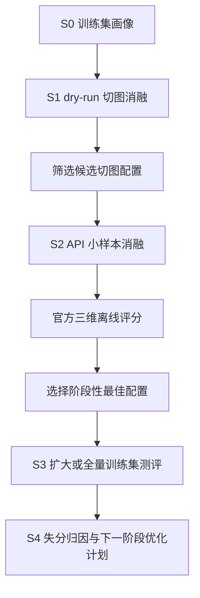

# 训练集切图实验与测评分析设计

## 1. 目标

本设计用于指导后续训练集实验，先探索图片切分的阶段性最佳方案，再基于训练集测评结果定位失分原因并制定下一阶段优化计划。

核心问题：

1. 当前 `finix_restore` 流水线在训练集 long/table 两类图片上的真实三维得分是多少。
2. 不同切图像素预算对 API 成功率、请求量、耗时、Text Edit、Table TEDS、Read Order Edit 和 Overall 的影响是什么。
3. 失分主要来自 API 失败、切块截断/重复、标题层级/段落切分，还是表格结构还原。
4. 下一阶段应优先优化切图、API 调度、标题归一化、接缝去重还是表格合并。

## 2. 约束

- 只允许调用 FinixDoc-VL，不能接入其他外部大模型或 VLM API。
- 不读取、打印、提交或写入 `.env` 中的真实 `apiKey`、`userIds`。
- `data/` 是只读输入，不修改、重命名或覆盖训练集图片和 GT。
- 忽略 `.ignore/` 下所有文件。
- 不按训练集、A 榜或 B 榜文件名做特判逻辑；抽样和策略只能依赖尺寸、像素、doc_type、版面提示和配置。
- 实验产物全部写入 `outputs/`，不提交运行产物。
- 本设计只定义实验方案；训练集测评和 API 调用需在用户确认规格后进入实施计划再执行。

## 3. 当前可用基础

源码目录：

- `/Users/lzc/TNTprojectZ/AprojectZ/AFAC2026-Task2/finix_restore`

关键能力：

- `Pipeline` 支持 profiler、layout sentry、chunker、FinixDoc-VL 调度、normalizer、reading order、dedup、table merger、quality gate 和 submission writer。
- `ChunkConfig` 已支持 long/table/normal 分层像素预算。
- `LongStripChunker` 已支持动态窗口、内容区裁剪、水平空白带切线和 manifest 审计字段。
- `TableGridChunker` 已支持二维网格、内容区裁剪、空白带切线、overlap 后像素预算校验。
- `finix_restore.eval.cli` 已支持官方对齐三维离线评分。
- `scripts/chunk_budget_experiment/` 已有 dry-run 和 API smoke 的预算实验脚本。

训练集输入：

| 子集 | 图片目录 | GT 目录 |
| --- | --- | --- |
| long | `/Users/lzc/TNTprojectZ/AprojectZ/AFAC2026-Task2/data/AFAC 训练数据集/finixdocbench_huge_long_100/images` | `/Users/lzc/TNTprojectZ/AprojectZ/AFAC2026-Task2/data/AFAC 训练数据集/finixdocbench_huge_long_100/mds` |
| table | `/Users/lzc/TNTprojectZ/AprojectZ/AFAC2026-Task2/data/AFAC 训练数据集/finixdocbench_huge_table_100/images` | `/Users/lzc/TNTprojectZ/AprojectZ/AFAC2026-Task2/data/AFAC 训练数据集/finixdocbench_huge_table_100/mds` |

## 4. 总体实验流程



阶段划分：

| 阶段 | 目的 | 输入 | 是否调 API | 主要产出 |
| --- | --- | --- | --- | --- |
| S0 | 建立训练集 long/table 分桶 | 训练集 200 张 | 否 | 尺寸、像素、doc_type、风险分桶 |
| S1 | 比较不同切图预算的 chunk 数、像素和风险 | 全量训练集 | 否 | `summary.csv`、manifest、QC |
| S2 | 验证切图对真实 API 耗时和得分的影响 | long/table 各 10-20 张 | 是 | 每文件三维分数、耗时、失败率 |
| S3 | 用胜出配置测当前 pipeline | 优先全量 200 张，配额不足时用分桶样本 | 是 | baseline 或候选配置训练集得分 |
| S4 | 定位失分原因并制定下阶段方案 | S2/S3 结果 | 否 | P0/P1/P2 优化清单 |

## 5. 切图候选矩阵

默认从当前配置和相邻预算开始，不一次性做大规模全量 API 网格。

| 实验 ID | long target | long safe | table target | table safe | 用途 |
| --- | ---: | ---: | ---: | ---: | --- |
| `baseline_5m` | 6M | 8M | 5M | 7M | 当前默认配置基线 |
| `table_4m_safe` | 6M | 8M | 4M | 6M | 降低密集表格超时风险 |
| `balanced_6m` | 6M | 8M | 6M | 8M | 比较请求数减少是否提升整体效率 |
| `long_4m_table_4m` | 4M | 6M | 4M | 6M | 保守稳定上限，用于极端样本 |
| `large_8m_probe` | 8M | 10M | 8M | 10M-12M | 仅 dry-run 和极小 API 探测，不直接全量跑 |

固定参数：

- `hard_max_pixels = 16_777_216`
- `crop_margin_px = 24`
- table `horizontal_overlap = 160`
- table `vertical_overlap = 220`
- long `vertical_overlap = 320`
- API 阶段默认 `runtime.image_concurrency = 1`
- API 阶段默认全局并发不超过 2，必要时降到 1

决策规则：

- `over_hard_chunks > 0` 的配置直接淘汰。
- `over_safe_chunks` 大量出现且集中在 table 类时，优先下调 table target 或 safe。
- `chunks_total` 增长明显但 API 失败率没有下降时，不采用更小切片。
- `large_8m_probe` 只用于判断大切片是否有潜在收益，不作为默认全量配置。

## 6. 样本抽取设计

抽样不能使用文件名特判。S2 小样本按以下字段分层：

- `doc_type`: `long_strip`、`table_page`
- 像素分位：P10、P30、P50、P70、P90、P99
- dry-run chunk 数分位
- 是否出现 `over_safe_pixels`
- table 类的表格线密度或切片数

建议样本量：

| 阶段 | long 张数 | table 张数 | 说明 |
| --- | ---: | ---: | --- |
| S2 smoke | 10 | 10 | 快速排除明显不稳配置 |
| S2 expanded | 20 | 20 | 对前两名候选配置加密验证 |
| S3 | 100 | 100 | 优先全训练集；API 限流严重时改为分桶代表样本 |

样本清单应写入 `outputs/chunk_eval/<run_id>/sample_manifest.csv`，字段至少包含：

- `file_name`
- `subset`
- `width`
- `height`
- `pixels`
- `doc_type`
- `bucket`
- `selected_reason`

## 7. 运行产物布局

建议统一写入：

```text
outputs/chunk_eval/
├── s0_profile/
│   ├── train_profile.csv
│   └── bucket_summary.csv
├── s1_dry_run/
│   ├── baseline_5m/
│   ├── table_4m_safe/
│   ├── balanced_6m/
│   ├── long_4m_table_4m/
│   ├── large_8m_probe/
│   └── summary.csv
├── s2_api_ablation/
│   ├── sample_manifest.csv
│   ├── baseline_5m/
│   ├── table_4m_safe/
│   ├── balanced_6m/
│   └── comparison.md
├── s3_train_eval/
│   ├── selected_config.yaml
│   ├── submission.csv
│   ├── metrics.json
│   └── failure_analysis.md
└── final_report.md
```

每次 API 实验必须保留：

- 配置快照
- `chunks/*/manifest.json`
- `logs/run.jsonl`
- `merged/*.md`
- `submission.csv`
- `metrics.json`
- CSV 格式校验结果

## 8. 评分口径

评分入口：

```bash
python -m finix_restore.eval.cli \
  --pred outputs/chunk_eval/s3_train_eval/submission.csv \
  --gt "data/AFAC 训练数据集/finixdocbench_huge_long_100/mds" \
  --output outputs/chunk_eval/s3_train_eval/metrics_long.json
```

如 long/table 分开跑，分别生成 `metrics_long.json` 和 `metrics_table.json`；最终报告再汇总。

评分公式：

```text
Overall = ((1 - Text Edit) * 100 + Table TEDS + (1 - Read Order Edit) * 100) / 3
```

报告必须同时给出：

- `mean_text_edit`
- `mean_table_teds`
- `mean_read_order_edit`
- `mean_overall`
- `table_sample_count`
- 每文件明细中的最差 Top N

无表样本的单文件 Overall 中表格分量按 100 计；`mean_table_teds` 只统计含表样本。

## 9. 失分归因

每个候选配置至少按以下维度做归因：

| 归因类别 | 判断依据 | 影响指标 | 处理方向 |
| --- | --- | --- | --- |
| API 失败或空输出 | `failed_chunks`、空 `merged`、重试日志 | 三项全降 | 降并发、长退避、换 userId、缩小切片 |
| 切块截断 | 接缝处句子/表格行不完整，manifest `fixed_cut` 高 | Text、ReadOrder、TEDS | 增加空白带切线、调整 overlap |
| overlap 重复 | 相邻块重复段落或重复表头 | Text、ReadOrder | 调整 dedup 阈值和窗口 |
| 标题层级不一致 | `#` 层级、列表项和编号标题错配 | ReadOrder | 编号标题归一化、prompt 约束 |
| 段落切分不一致 | 同内容被拆分或合并为不同逻辑块 | ReadOrder | 后处理段落合并策略、prompt 约束 |
| 表格 OCR 错误 | 数字、费率、符号识别错误 | Text、TEDS | 缩小 table 切片、按行切、提高超时 |
| 表格结构错误 | `<tr>/<td>` 数量差异、rowspan/colspan 丢失 | TEDS | 表格行级拼接、HTML 修复 |

S4 输出应包含：

- long/table 分别的最差 Top 10 文件。
- 每类失分的样例文件和证据路径。
- 每类问题的优先级、预期收益和实施风险。

## 10. 实验命令草案

dry-run 可复用现有脚本：

```bash
bash scripts/chunk_budget_experiment/run_dry_run_all.sh

python scripts/chunk_budget_experiment/aggregate_dry_run.py \
  --root outputs/chunk_budget/dry_run \
  --out outputs/chunk_budget/dry_run/summary.csv
```

单配置训练集预测命令模板应按 long/table 分开运行，避免一个预测 CSV 对不上单一 GT 目录：

```bash
python -m finix_restore.cli \
  --input_dir "data/AFAC 训练数据集/finixdocbench_huge_long_100/images" \
  --output_csv outputs/chunk_eval/s3_train_eval/long_submission.csv \
  --work_dir outputs/chunk_eval/s3_train_eval/long_run \
  --config outputs/chunk_eval/s3_train_eval/selected_config.yaml \
  --image_concurrency 1

python -m finix_restore.cli \
  --input_dir "data/AFAC 训练数据集/finixdocbench_huge_table_100/images" \
  --output_csv outputs/chunk_eval/s3_train_eval/table_submission.csv \
  --work_dir outputs/chunk_eval/s3_train_eval/table_run \
  --config outputs/chunk_eval/s3_train_eval/selected_config.yaml \
  --image_concurrency 1
```

对应评分命令：

```bash
python -m finix_restore.eval.cli \
  --pred outputs/chunk_eval/s3_train_eval/long_submission.csv \
  --gt "data/AFAC 训练数据集/finixdocbench_huge_long_100/mds" \
  --output outputs/chunk_eval/s3_train_eval/long_metrics.json

python -m finix_restore.eval.cli \
  --pred outputs/chunk_eval/s3_train_eval/table_submission.csv \
  --gt "data/AFAC 训练数据集/finixdocbench_huge_table_100/mds" \
  --output outputs/chunk_eval/s3_train_eval/table_metrics.json
```

CSV 校验要求：

- 可被 `pandas.read_csv` 或标准 `csv.DictReader` 正常读取。
- 列名严格为 `file_name,ground_truth`。
- 行数等于输入图片数。
- `file_name` 无重复。
- `ground_truth` 允许为空但必须记录为空输出风险；正式结论中不能忽略空输出。

## 11. 通过标准

S1 通过标准：

- 所有候选配置 `over_hard_chunks == 0`。
- 每个候选配置有全量 dry-run 汇总。
- 至少保留 2 个进入 S2 的候选配置。

S2 通过标准：

- 每个候选配置完成相同样本集测评。
- 报告 API 请求数、失败请求数、P50/P95/max 耗时。
- 报告 Text Edit、Table TEDS、Read Order Edit、Overall。
- 能解释候选配置之间的差异，而不是只给总分。

S3 通过标准：

- 用 S2 胜出配置跑训练集扩大样本或全量。
- 输出 CSV 通过格式校验。
- 评分 JSON 可复现生成。
- 若未能全量跑完，必须记录原因、已覆盖样本、未覆盖风险。

S4 通过标准：

- 明确阶段性最佳切图配置。
- 明确当前得分和主要失分项。
- 给出下一阶段 P0/P1/P2 优化方案。
- 不提出违反赛题限制的模型/API 方案。

## 12. 预期结论格式

最终 Markdown 报告建议包含：

```text
1. 实验摘要
2. 数据与样本覆盖
3. 切图 dry-run 结果
4. API 小样本消融结果
5. 训练集扩大测评结果
6. long/table 分桶得分
7. 失分原因定位
8. 阶段性最佳配置
9. 下一阶段优化计划
10. 复现命令与产物路径
```

下一阶段优化计划按优先级输出：

- P0：会阻断有效得分或复现的工程问题。
- P1：直接影响主指标且风险可控的算法/规则问题。
- P2：收益不确定或需要更多验证的问题。

## 13. 非目标

- 本轮不引入新的外部 OCR、表格模型或大模型。
- 本轮不重写主 pipeline。
- 本轮不把训练集 GT 用于面向文件名的规则特判。
- 本轮不为了提高训练集分数而写不可泛化的人工修补。
- 本轮不提交 `outputs/` 下任何运行产物。
