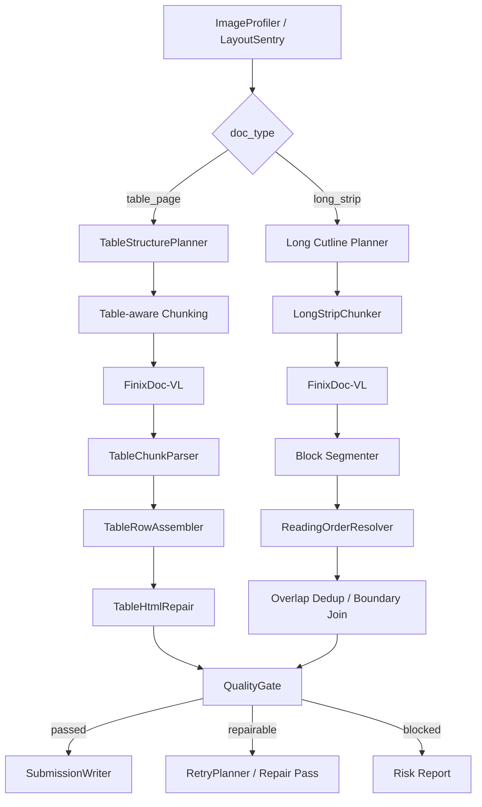

# 表格结构重建与阅读顺序优化设计

## 1. 背景

本设计承接 `balanced_6m_full` A 榜运行和 `s4_full_train` 训练集运行后的诊断结论。当前 A 榜提交得分为 60.7775，距离 A 榜最高 85.35 仍有 24.5725 分差。提交 CSV 格式校验通过，问题主要来自内容质量而非提交格式。

已确认的关键证据：

- A 榜提交文件 100 行、列名正确、无重复文件名、无空输出。
- A 榜 100 张中包含 50 张 `long_strip`、50 张 `table_page`；质量风险全部集中在 `table_page`，20/50 个 table 文件被标红，其中 `html_broken=18`、`high_duplication=3`。
- 训练 long 全量 Overall 为 64.40，Text Edit 为 0.0831，Read Order Edit 为 0.7128。预测/GT 长度比均值为 1.014，说明 long 文本大体读出，但阅读顺序和结构块顺序损失严重。
- 用训练 table 的 `merged/*.md` 临时重建预测 CSV 后，全量 table Overall 为 -0.75，Text Edit 为 0.6741，Table TEDS 为 13.86，Read Order Edit 为 1.4868。100 个 table 样本中 59 个预测长度低于 GT 的一半。
- 最差 table 样本 `5fdf46b0-a5e8-4081-bb60-50fe54006ba8.jpg` 为 371,960,944 像素，被切成 8x8 共 64 个 chunk，合并后包含 74 个 `<table>`、41060 个 `<td>`，但仍 `html_broken`，TEDS 仅 0.056。

## 2. 目标

下一阶段采用“方案 A：结构优先的针对性修复”。目标是在不引入其他大模型 API、不修改 `data/` 原始输入、不硬编码测试文件名的前提下，优先修复当前最影响分数的结构性瓶颈。

阶段目标：

1. 将 table 页从“二维网格块串接”升级为“结构可恢复的切分与表格行级重建”。
2. 将 long 页从“按 y 坐标串接 chunk”升级为“逻辑块级阅读顺序恢复与接缝处理”。
3. 将质量门从“发现风险但仍可用 merged 组装提交”升级为“风险驱动的修复、重跑和阻断策略”。
4. 建立可重复的 smoke/eval 闭环，输出 long/table 分项指标、风险清单、最差 TopN 和长度比审计。

期望指标方向：

- table smoke test：`html_broken=0`，Table TEDS 明显高于当前训练 table 全量 13.86。
- train table partial/full：Text Edit、Table TEDS、Read Order 三项均有独立改善，不能只靠长度或重复堆内容。
- train long：Read Order Edit 从当前 0.7128 先压到 0.55 以下，Overall 从 64.40 提升到 70+。
- A 榜提交前：风险清单中 table `html_broken` 大幅下降，不再直接提交已知破损的 table HTML。

## 3. 非目标

本阶段不做以下事项：

- 不接入 FinixDoc-VL 之外的外部大模型、VLM 或 OCR API。
- 不修改、移动、重命名或覆盖 `data/` 下原始图片和 GT。
- 不按训练集、A 榜或 B 榜文件名写特判逻辑。
- 不追求一次性重构整个 pipeline；只围绕 table、long 阅读顺序和质量门闭环做集中改动。
- 不在计划文档中塞入大段完整实现。

## 4. 总体设计



设计原则：

- table 页优先保持表格行和列的可重建关系。切块可以分片，但必须保留足够元数据，让后处理知道哪些 chunk 属于同一表格、同一行带或同一列带。
- long 页优先保护自然阅读块。文本完整性已经较好，重点是减少固定切线穿过结构块导致的错序和重复。
- 后处理规则必须可解释、可审计，可通过训练集和局部样本复现。

## 5. 组件设计

### 5.1 TableStructurePlanner

职责：在 table 切块前，根据缩略图投影和线条密度生成更适合表格恢复的切分计划。

输入：

- `ImageProfile`
- `LayoutHints`
- table 配置中的像素预算、overlap、cut search 参数

输出：

- `table_plan.json`，包含 `content_box`、行带切线、列带切线、切线来源、风险标记和估算 chunk 形态。

规则：

- 优先寻找水平表格行边界或大空白带，避免横向切线穿过表格行。
- 对超宽表格，允许列向切分，但必须记录列带索引和列边界重叠区域。
- 对超大现金价值表等规则巨表，优先生成“行带完整宽度”或“行带 x 列带”的可重建计划，而不是只按像素平方根估算网格。
- 如果只能固定网格切分，显式标记 `fixed_cut` 和 `requires_row_assembly`，供质量门和报告使用。

### 5.2 Table-aware Chunking

职责：根据 `TableStructurePlanner` 输出创建 chunk，并保留重建所需元数据。

新增或强化的 chunk 元数据：

- `table_group_id`
- `row_band`
- `col_band`
- `base_bbox`
- `overlap_bbox`
- `cut_source`
- `requires_row_assembly`

策略：

- 小 table 仍优先整页解析。
- 中等 table 优先按行带切，不做横向切分。
- 极大 table 在必须二维切分时，保证同一 row_band 的所有 col_band 可在后处理按视觉行合并。

### 5.3 TableChunkParser

职责：从每个 chunk 的 Markdown 中提取表格结构和局部文本，为跨 chunk 合并提供结构化输入。

输出结构：

- chunk 级标题和表前说明文本。
- table 列表，每个 table 包含行数组、单元格文本、原始 HTML、闭合标签状态和局部表头候选。
- 解析失败时保留原文，并生成 `table_parse_failed` 风险。

实现约束：

- 保留空 `<td></td>`。
- 不改写金额、费率、年龄、保单年度等金融数值。
- 不强制把 HTML 表格转成管道 Markdown。

### 5.4 TableRowAssembler

职责：解决当前 table 低分的核心问题：把同一视觉表格被横向/纵向切开的局部结果重建成稳定表格。

合并层次：

1. 同一 chunk 内修复标签闭合。
2. 同一 row_band 内按 `col_band` 合并横向切开的行。
3. 相邻 row_band 间去除重复表头，拼接连续行。
4. 对重叠区域中的重复行做行级去重。

关键规则：

- 横向合并时，以行序、左侧关键列、投保年龄/性别/年度等稳定字段对齐。
- 如果左右 chunk 行数不一致，优先使用重叠区文本相似度和 bbox 顺序对齐，不能确定时保留原局部表并标记 `row_alignment_uncertain`。
- 纵向合并时，重复表头只保留一次，但目录、表题和说明文字不按普通重复删除。
- 允许输出多个 `<table>`，但不能因为切块造成每个 chunk 都输出独立表而不合并。

### 5.5 TableHtmlRepair

职责：在 `TableRowAssembler` 后做保守 HTML 合法化。

能力：

- 补齐未闭合 `</table>`、`</tr>`、`</td>`、`</th>`。
- 删除 BeautifulSoup 因破损 HTML 引入的多余外层 `<html><body>`。
- 统一输出可被评测脚本解析的 table HTML。
- 记录修复计数和无法修复原因。

### 5.6 Long Cutline Planner

职责：提高 long 切块边界质量，减少 `fixed_cut`。

当前证据显示：

- 训练 long 2040 个 chunk 中 1940 个为 `fixed_cut`。
- A 榜 long 1016 个 chunk 中 965 个为 `fixed_cut`。

优化方向：

- 调整水平空白带检测阈值和最小长度，适配长条保险条款截图。
- 在目标切线附近优先避开标题、表格行、编号列表和段落中间。
- 对找不到空白带的区域扩大 overlap 或降低窗口高度，减少硬切造成的边界断裂。

### 5.7 Block Segmenter 与 ReadingOrderResolver

职责：将 chunk 输出切成逻辑块，再排序和合并。

逻辑块类型：

- title
- paragraph
- list_item
- table
- toc
- header_footer
- footnote

排序规则：

- long 普通文本仍以纵向顺序为主，但同一 overlap 区域要按块级相似度去重。
- 目录块和正文标题允许相似，不因重复而删除。
- 表格块整体保护，但表格内部交给 TableRowAssembler。
- 页眉页脚进入弱保留策略：重复页眉页脚可去除，正文相似内容不误删。

### 5.8 QualityGate 与 RetryPlanner

职责：把质量风险变成可执行动作，而不是只写报告。

阻断或修复规则：

- `html_broken`：先执行 TableHtmlRepair；仍失败则触发 table 重跑或标记 blocked，不直接进入最终提交。
- `high_duplication`：执行行级/块级去重审计；重复率仍高则进入风险报告。
- `too_short`：对比同类长度分布和 GT 不可见场景下的预测长度分位，触发缩小切片或增加 overlap 重跑。
- `api_failure_ratio_high`：降低并发、强制 API、必要时缩小 chunk。

提交前要求：

- CSV 可读。
- 列名为 `file_name,ground_truth`。
- 行数正确。
- 无重复文件名。
- 无空输出。
- table `html_broken` 风险数量必须显式报告；若非 0，需要人工确认是否仍提交。

## 6. 数据流与产物

新增或强化运行产物：

```text
outputs/<run_id>/
├── table_plans/{file}.json
├── table_parsed/{file}/{chunk_id}.json
├── table_assembled/{file}.json
├── block_segments/{file}.json
├── merged/{file}.md
├── qc/{file}.json
├── qc/summary.json
└── eval_summary.md
```

报告必须包含：

- long/table 分项指标。
- Text Edit、Table TEDS、Read Order Edit、Overall。
- 预测/GT 长度比统计。
- 最差 Top 10 文件。
- `html_broken`、`high_duplication`、`too_short`、`api_failure_ratio_high` 风险统计。
- chunk shape 分布，例如 1x1、1x2、2x2、4x4、8x8。

## 7. 测试设计

新增或更新测试应覆盖：

1. TableChunkParser 能解析闭合和部分破损的 table，保留空 td。
2. TableRowAssembler 能横向合并同一 row_band 的左右表格片段。
3. TableRowAssembler 能纵向去除重复表头并拼接连续行。
4. TableHtmlRepair 能补齐缺失闭合标签，不引入 `<html><body>` 外壳。
5. Long Cutline Planner 在构造投影中优先选择空白带而不是固定切线。
6. Block Segmenter 能识别目录、标题、表格、普通段落和页眉页脚。
7. QualityGate 对 `html_broken` 不再只报告，能产生修复或重跑动作。
8. Submission 校验仍保证 CSV 可读、列名正确、行数正确、无重复文件名。

## 8. 验证流程

实施后按以下顺序验证：

1. 单元测试：运行相关 tests，至少覆盖 table parser/assembler/repair、long cutline、quality gate、submission。
2. 本地离线构造样本：验证表格横向/纵向合并和 HTML 修复。
3. 训练 table smoke：选 5 张代表样本，要求 `html_broken=0`，并与当前 merged 结果比较 Table TEDS。
4. 训练 long smoke：选 5 张 worst Read Order 样本，比较 Read Order Edit。
5. 训练集扩大评测：优先 long/table 各 20 张；稳定后进入 100 张全量。
6. A 榜提交前审计：生成风险报告，确认没有未解释的破损 table 大量进入提交。

## 9. 风险与应对

| 风险 | 表现 | 应对 |
| --- | --- | --- |
| 行对齐错误 | 横向合并错行，TEDS 更低 | 只在行数、关键列、相似度满足阈值时合并；不确定则保留局部表并标风险 |
| 过度去重 | 目录、重复表头、相似条款被误删 | 引入块类型保护和 row_band/overlap 约束 |
| 修复 HTML 破坏文本 | BeautifulSoup 改写金融字符或数字 | 只做标签级修复，不改写单元格文本 |
| API 成本上升 | 更小或更保守切块导致请求数增加 | 先 smoke，再 partial，再全量；用缓存和强制重跑开关控制成本 |
| long 切线过度寻找空白 | 产生过小 chunk 或遗漏区域 | 保留覆盖审计和最小窗口高度，manifest 检查无间隙 |

## 10. 实施优先级

P0：

- TableChunkParser
- TableRowAssembler 的横向/纵向基础合并
- TableHtmlRepair
- QualityGate 对 `html_broken` 的修复/阻断闭环
- table 5 张 smoke test

P1：

- Long Cutline Planner
- Block Segmenter
- long worst Read Order 样本评估
- table 20 张 partial eval

P2：

- 更完整的风险报告和 eval summary
- A 榜提交前自动审计脚本
- 参数矩阵小规模消融

## 11. 退出标准

本阶段完成的最低标准：

- table smoke 结果不再出现 `html_broken`。
- 至少一个训练 table partial 的 Table TEDS 显著高于当前 13.86。
- long partial 的 Read Order Edit 低于当前全量均值 0.7128。
- 提交前风险报告能明确列出所有 remaining high-risk 文件及原因。
- 所有新增逻辑都有可重复单元测试或离线构造测试。
