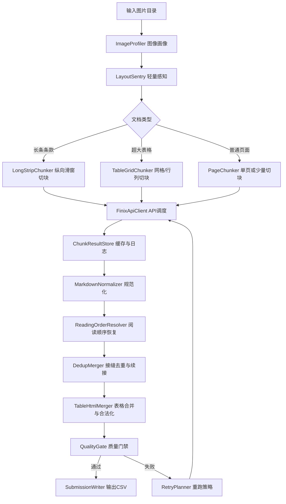

# 复杂金融文档还原挑战：技术架构文档

## 1. 架构目标

技术架构的目标是在不违反赛题模型限制的前提下，最大化文本完整性、结构保真度、阅读顺序正确性和工程可复现性。核心原则是：本地只做轻量、可解释、可审计的图像感知和后处理；复杂视觉文档解析由 FinixDoc-VL API 完成；跨块拼接和质量门禁由规则与统计方法完成。

## 2. 总体架构



## 3. 模块设计

### 3.1 ImageProfiler 图像画像模块

职责：读取每张图片的宽、高、像素数、文件大小、长宽比、预估内存占用，并生成文件级 profile。

输出字段：

| 字段 | 说明 |
| --- | --- |
| `file_name` | 图片文件名。 |
| `width` / `height` | 原图宽高。 |
| `pixels` | 总像素。 |
| `aspect` | `max(width,height) / min(width,height)`。 |
| `doc_type` | `long_strip`、`table_page`、`normal_page`、`unknown`。 |
| `risk_level` | `low`、`medium`、`high`、`extreme`。 |

### 3.2 LayoutSentry 轻量感知模块

职责：在缩略图或灰度图上进行低成本结构感知，不直接生成最终文本。

可实现能力：

1. 水平投影：寻找长条文档的空白切线。
2. 垂直投影：检测多栏分隔与表格列密度。
3. 线条检测：用形态学操作估计表格横线、竖线密度。
4. 边缘裁剪：识别大面积白边，减少无效 API 输入。
5. 方向检测：识别横置/竖置表格，必要时旋转或按宽高选择切块方向。

### 3.3 Chunker 切块模块

#### 3.3.1 长条文档切块

推荐策略：

- 固定宽度保持原图宽度，不横向切分。
- 基础窗口高度：3,000–5,000px。
- 基础 overlap：200–400px。
- 如果窗口内文本密度过高或 API 返回截断，则降低窗口高度。
- 切线优先选在空白水平带；如果找不到空白带，则使用固定窗口并扩大 overlap。

伪代码：

```python
for y0 in range(0, image_height, stride):
    y1 = min(y0 + window_height, image_height)
    y1 = adjust_to_nearest_blank_band(y1)
    crop = image.crop((0, y0, image_width, y1))
    save_chunk(crop, x0=0, y0=y0, x1=image_width, y1=y1)
```

#### 3.3.2 表格文档切块

推荐策略：

- 当像素数较低且 API 可承受时，先尝试整页解析，作为全局参考。
- 对超大图，按二维网格切块；切块边界尽量落在表格行线或空白区域。
- 横向 overlap 保证跨列标题不丢失；纵向 overlap 保证跨行不截断。
- 保存每个切块的网格坐标，后续按 `row_index, col_index` 排序。

伪代码：

```python
x_cuts = find_vertical_cuts_by_projection(image)
y_cuts = find_horizontal_cuts_by_projection(image)
for row, (y0, y1) in enumerate(pairwise(y_cuts)):
    for col, (x0, x1) in enumerate(pairwise(x_cuts)):
        crop = image.crop((x0 - ox, y0 - oy, x1 + ox, y1 + oy))
        save_chunk(crop, row=row, col=col, bbox=(x0, y0, x1, y1))
```

### 3.4 FinixApiClient API 适配模块

职责：封装 FinixDoc-VL API 表单上传、超时、重试、限流、错误处理与缓存。

设计要点：

1. 配置从环境变量读取，禁止在代码和文档中明文写入密钥。
2. 每个切块请求生成 `request_id = sha1(file_name + bbox + image_hash)`，用于缓存。
3. API 返回 Markdown 后原样保存，后处理不覆盖原始响应。
4. 对超时、空响应、明显异常响应执行指数退避重试。
5. 并发数根据 API 稳定性动态调整，初始建议 2–4。

### 3.5 MarkdownNormalizer 规范化模块

职责：做最小必要规范化，避免破坏金融文本。

允许操作：

- 统一换行符为 `
`。
- 去除代码块外多余尾随空格。
- 修复明显破损的 Markdown 标题空格，例如 `##1.1` → `## 1.1`。
- 标准化 HTML 标签大小写为小写。
- 删除 API 返回中明显与图片无关的免责声明或错误提示。

禁止操作：

- 自动改写金额、百分比、备案号、条款号。
- 简繁转换。
- 把 HTML 表格强制转成管道 Markdown 表格。
- 大规模同义替换或语义重写。

### 3.6 ReadingOrderResolver 阅读顺序模块

职责：将切块结果排序为文档级阅读流。

规则组合：

1. 坐标主排序：长条按 `y0`，表格按 `row, col`。
2. 列检测：若页面存在多栏，先列内从上到下，再按列从左到右；对横向跨栏标题放在列内容之前。
3. 标题编号：利用 `1`、`1.1`、`1.1.1`、`（一）`、`第一条` 等编号连续性修正局部顺序。
4. 表格块保护：表格内部不参与普通段落排序，整体作为块插入。
5. 目录区保护：目录项和正文标题可重复出现，不按普通重复块删除。

### 3.7 DedupMerger 去重与续接模块

职责：处理 overlap 导致的重复和切块边界导致的截断。

核心方法：

1. 对相邻切块末尾与开头取 500–1500 字窗口。
2. 计算最长公共后缀/前缀、编辑距离、n-gram 相似度。
3. 如果匹配发生在 overlap 区，删除后一块重复前缀。
4. 如果前一块以未闭合句子、未闭合括号、未闭合 `<td>` 结束，优先续接后一块。
5. 若重复内容是目录项或页眉页脚，使用块类型和坐标决定是否保留。

简化伪代码：

```python
merged = chunks[0].markdown
for next_chunk in chunks[1:]:
    overlap = detect_text_overlap(tail(merged), head(next_chunk.markdown))
    if overlap.confidence >= threshold:
        merged += next_chunk.markdown[overlap.end_in_next:]
    else:
        merged += "

" + next_chunk.markdown
```

### 3.8 TableHtmlMerger 表格合并模块

职责：对 HTML 表格做跨块合并和合法化。

处理流程：

1. 将 Markdown 切分为文本块与 HTML 表格块。
2. 对每个表格块解析 `<table>`、`<tr>`、`<td>`。
3. 如果相邻切块都包含同一表格的连续行，则去除重复表头并合并 `<tr>`。
4. 检查每行单元格数量，发现明显短行时尝试从相邻块补齐；无法补齐则保留原文并记录风险。
5. 保留空 `<td></td>`，不删除空列。
6. 输出闭合的 `<table border="1" cellpadding="8" cellspacing="0">` 结构，或保留 API 原结构。

### 3.9 QualityGate 质量门禁模块

质检项：

| 质检项 | 阈值/规则 | 动作 |
| --- | --- | --- |
| 空输出 | `len(markdown.strip()) == 0` | 重跑该图或扩大切块。 |
| 异常短输出 | 输出长度显著低于同类分位数 | 标记高风险并重跑。 |
| 重复率 | 相邻 200 字窗口重复超过阈值 | 重新执行去重。 |
| HTML 合法性 | 标签不闭合 | 尝试修复；失败则重跑表格切块。 |
| CSV 可读性 | `pandas.read_csv` 可读且行数匹配 | 不通过则阻断提交。 |
| API 失败率 | 单图失败切块比例过高 | 降低并发、缩小切块、重试。 |

## 4. 数据流与中间产物

推荐保存如下中间产物：

```text
outputs/
├── profiles/{file}.json             # 图像画像
├── chunks/{file}/{chunk_id}.jpg      # 切块图片
├── chunks/{file}/manifest.json       # 切块坐标、类型、hash
├── api_raw/{file}/{chunk_id}.md      # API 原始返回
├── normalized/{file}/{chunk_id}.md   # 规范化后返回
├── merged/{file}.md                  # 文件级合并结果
├── qc/{file}.json                    # 质检结果
├── logs/run.jsonl                    # 全局运行日志
└── submission.csv                    # 最终提交
```

## 5. 工程目录建议

```text
src/
├── main.py
├── run.sh
├── requirements.txt
├── configs/
│   ├── default.yaml
│   ├── chunk_long.yaml
│   └── chunk_table.yaml
├── src/
│   ├── profiler.py
│   ├── layout_sentry.py
│   ├── chunkers.py
│   ├── finix_api.py
│   ├── markdown_normalizer.py
│   ├── reading_order.py
│   ├── dedup_merger.py
│   ├── table_merger.py
│   ├── quality_gate.py
│   └── submission_writer.py
├── tests/
│   ├── test_html_table.py
│   ├── test_dedup.py
│   └── test_submission.py
└── docs/
    ├── reproduce.md
    └── prompt_specs.md
```

## 6. 配置参数建议

| 参数 | 长条文档初值 | 表格文档初值 | 说明 |
| --- | --- | --- | --- |
| `max_chunk_pixels` | 6M–10M | 8M–16M | API 稳定后可上调。 |
| `long_window_height` | 3000–5000 | 不适用 | 长条纵向滑窗高度。 |
| `vertical_overlap` | 200–400 | 150–300 | 接缝去重与防截断。 |
| `horizontal_overlap` | 0 | 100–250 | 表格跨列保护。 |
| `api_timeout` | 120–240s | 180–300s | 大表格切块可更长。 |
| `max_retries` | 2–3 | 2–4 | 避免无限重试。 |
| `concurrency` | 2–4 | 1–3 | 表格大图更容易超时，宜保守。 |
| `dedup_window_chars` | 800–1500 | 300–800 | 表格以行级去重为主。 |

## 7. 端到端流程

```python
def run(input_dir, output_csv):
    image_files = list_images(input_dir)
    all_results = []
    for image_path in image_files:
        profile = ImageProfiler().profile(image_path)
        layout = LayoutSentry().analyze(image_path, profile)
        chunks = ChunkerFactory.create(profile, layout).split(image_path)
        raw_results = FinixApiClient().parse_chunks(chunks)
        normalized = MarkdownNormalizer().batch(raw_results)
        ordered = ReadingOrderResolver().sort(normalized, chunks, layout)
        merged = DedupMerger().merge(ordered)
        merged = TableHtmlMerger().repair_and_merge(merged)
        qc = QualityGate().check(merged, profile, chunks)
        if not qc.passed:
            merged = RetryPlanner().rerun(image_path, profile, qc)
        all_results.append((image_path.name, merged))
    SubmissionWriter().write(all_results, output_csv)
```

## 8. 消融实验设计

| 实验 | 变量 | 预期观察 |
| --- | --- | --- |
| E1 基线 | 整图 API 解析 | 小图效果可参考，大图失败率高。 |
| E2 固定滑窗 | 固定窗口 + overlap | 长条可用，但接缝重复明显。 |
| E3 空白线切块 | 在 E2 上加入投影找空白切线 | 截断率下降。 |
| E4 去重增强 | 加入 DedupMerger | 文本编辑距离下降。 |
| E5 表格网格切块 | 表格按网格切分 | 大表格成功率上升，但拼接复杂。 |
| E6 表格合法化 | 加入 TableHtmlMerger | TEDS 更稳定。 |
| E7 质量门禁重跑 | 异常短/HTML破损触发重跑 | 鲁棒性提升，耗时增加。 |

## 9. 风险与应对

| 风险 | 表现 | 应对 |
| --- | --- | --- |
| API 超时 | 大切块无返回 | 降低 `max_chunk_pixels`，缩小窗口，增加重试。 |
| 接缝重复 | 同一段文字出现两次 | 使用 overlap 文本匹配与坐标约束去重。 |
| 接缝漏字 | 段落中断或表格行断裂 | 增大 overlap，空白线切块，边界切块重跑。 |
| 表格错列 | TEDS 大幅下降 | 行列数校验，空单元格保护，表格按 `<tr>` 合并。 |
| 目录误删 | 目录标题和正文标题相似 | 识别目录区并设置去重保护。 |
| 过度纠错 | 数字/条款号被改错 | 保守规范化，只修复结构，不改写内容。 |
| 复现不一致 | 多次运行输出不同 | 缓存 API 原始返回，固定配置，记录版本与 hash。 |

## 10. 实施路线

### 阶段一：基线闭环

完成图片读取、简单切块、API 调用、Markdown 合并、CSV 输出和日志。目标是所有样本能跑通。

### 阶段二：长条文档优化

加入纵向空白线切块、目录保护、标题层级修复和接缝去重。目标是降低文本编辑距离和阅读顺序错误。

### 阶段三：表格文档优化

加入表格线感知、二维网格切块、HTML 表格行级拼接、空单元格保护和标签合法化。目标是提升 TEDS。

### 阶段四：稳定性与复现

加入断点续跑、缓存、重试、质量门禁、配置冻结、单元测试和一键运行脚本。目标是满足 B 榜复现审核。

## 11. 提交与审计注意事项

1. `requirements.txt` 应尽量精简，避免封闭环境安装失败。
2. `.env.example` 只写变量名，不写真实密钥。
3. 所有 API 原始返回应保存在缓存中，方便复现与排查。
4. 不根据测试图片文件名写任何特殊输出逻辑。
5. 代码注释应说明每个规则的通用依据，例如像素阈值、投影切线、去重阈值来自训练集统计与验证实验。
6. 运行时间要纳入 CI 或本地压测，确保 100 张 B 榜图片在要求时间内完成。
